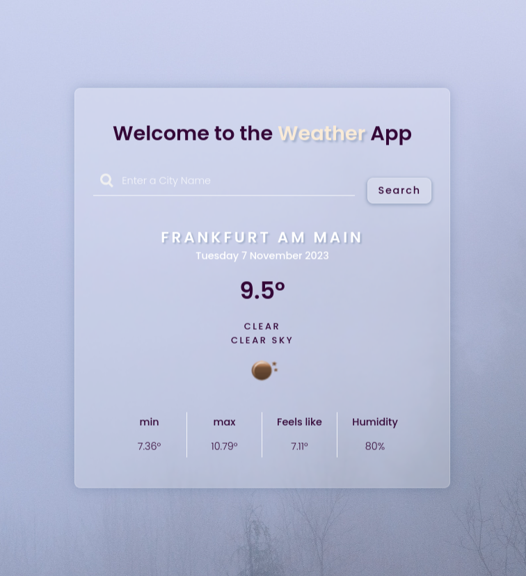

# Weather App

This Weather App allows users to search for the current weather conditions of any city using the OpenWeatherMap API. It's a simple and intuitive interface that provides instant weather updates including temperature, humidity, and general weather conditions.

## Features

- Search for weather information by city name.
- Get real-time weather updates.
- Displays temperature, humidity, and feels-like temperature.
- Responsive design for desktop and mobile devices.

## Usage

To use the Weather App:

1. Enter the name of the city in the input field.
2. Press the 'Search' button or the Enter key to display the weather.

## Built With

- HTML
- CSS
- JavaScript
- [OpenWeatherMap API](https://openweathermap.org/api)

## Demo

## Screenshots

